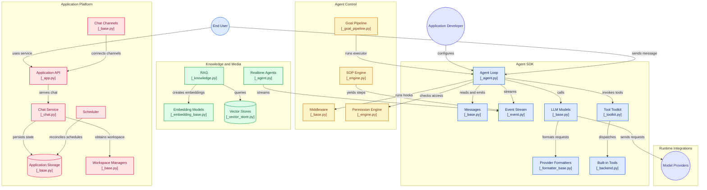

```mermaid
flowchart TD

subgraph group_sdk["Agent SDK"]
  node_agent["Agent Loop<br/>[_agent.py]"]
  node_messages["Messages<br/>[_base.py]"]
  node_events["Event Stream<br/>[_event.py]"]
  node_models["LLM Models<br/>[_base.py]"]
  node_formatters["Provider Formatters<br/>[_formatter_base.py]"]
  node_toolkit["Tool Toolkit<br/>[_toolkit.py]"]
  node_builtin["Built-in Tools<br/>[_backend.py]"]
end

subgraph group_control["Agent Control"]
  node_middleware["Middleware<br/>[_base.py]"]
  node_permissions["Permission Engine<br/>[_engine.py]"]
  node_pipeline["Goal Pipeline<br/>[_goal_pipeline.py]"]
  node_sop["SOP Engine<br/>[_engine.py]"]
end

subgraph group_knowledge["Knowledge and Media"]
  node_rag["RAG<br/>[_knowledge.py]"]
  node_embedding["Embedding Models<br/>[_embedding_base.py]"]
  node_vectorstore[("Vector Stores<br/>[_vector_store.py]")]
  node_realtime["Realtime Agents<br/>[_agent.py]"]
end

subgraph group_application["Application Platform"]
  node_app["Application API<br/>[_app.py]"]
  node_chat["Chat Service<br/>[_chat.py]"]
  node_channels["Chat Channels<br/>[_base.py]"]
  node_storage[("Application Storage<br/>[_base.py]")]
  node_scheduler["Scheduler"]
  node_workspace["Workspace Managers<br/>[_base.py]"]
end

subgraph group_runtime["Runtime Integrations"]
  node_external_models(("Model Providers"))
end

node_developer(("Application Developer"))
node_external_user(("End User"))

node_developer -->|"configures"| node_agent
node_external_user -->|"sends message"| node_agent
node_agent -->|"reads and emits"| node_messages
node_agent -->|"calls"| node_models
node_models -->|"formats requests"| node_formatters
node_models -->|"sends requests"| node_external_models
node_agent -->|"invokes tools"| node_toolkit
node_toolkit -->|"dispatches"| node_builtin
node_agent -->|"runs hooks"| node_middleware
node_agent -->|"checks access"| node_permissions
node_agent -->|"streams"| node_events
node_pipeline -->|"runs executor"| node_agent
node_sop -->|"yields steps"| node_events
node_rag -->|"creates embeddings"| node_embedding
node_rag -->|"queries"| node_vectorstore
node_realtime -->|"streams"| node_events
node_external_user -->|"uses service"| node_app
node_app -->|"serves chat"| node_chat
node_chat -->|"persists state"| node_storage
node_chat -->|"obtains workspace"| node_workspace
node_channels -->|"connects channels"| node_app
node_scheduler -->|"reconciles schedules"| node_storage

click node_agent "https://github.com/agentscope-ai/agentscope/blob/main/src/agentscope/agent/_agent.py"
click node_messages "https://github.com/agentscope-ai/agentscope/blob/main/src/agentscope/message/_base.py"
click node_events "https://github.com/agentscope-ai/agentscope/blob/main/src/agentscope/event/_event.py"
click node_models "https://github.com/agentscope-ai/agentscope/blob/main/src/agentscope/model/_base.py"
click node_formatters "https://github.com/agentscope-ai/agentscope/blob/main/src/agentscope/formatter/_formatter_base.py"
click node_toolkit "https://github.com/agentscope-ai/agentscope/blob/main/src/agentscope/tool/_toolkit.py"
click node_builtin "https://github.com/agentscope-ai/agentscope/blob/main/src/agentscope/tool/_builtin/_backend.py"
click node_middleware "https://github.com/agentscope-ai/agentscope/blob/main/src/agentscope/middleware/_base.py"
click node_permissions "https://github.com/agentscope-ai/agentscope/blob/main/src/agentscope/permission/_engine.py"
click node_pipeline "https://github.com/agentscope-ai/agentscope/blob/main/src/agentscope/pipeline/_goal_pipeline.py"
click node_sop "https://github.com/agentscope-ai/agentscope/blob/main/src/agentscope/sop/_engine.py"
click node_rag "https://github.com/agentscope-ai/agentscope/blob/main/src/agentscope/rag/_knowledge.py"
click node_embedding "https://github.com/agentscope-ai/agentscope/blob/main/src/agentscope/embedding/_embedding_base.py"
click node_vectorstore "https://github.com/agentscope-ai/agentscope/blob/main/src/agentscope/rag/_vdb/_vector_store.py"
click node_realtime "https://github.com/agentscope-ai/agentscope/blob/main/src/agentscope/agent/_realtime/_agent.py"
click node_app "https://github.com/agentscope-ai/agentscope/blob/main/src/agentscope/app/_app.py"
click node_chat "https://github.com/agentscope-ai/agentscope/blob/main/src/agentscope/app/_service/_chat.py"
click node_channels "https://github.com/agentscope-ai/agentscope/blob/main/src/agentscope/app/channel/_base.py"
click node_storage "https://github.com/agentscope-ai/agentscope/blob/main/src/agentscope/app/storage/_base.py"
click node_scheduler "https://github.com/agentscope-ai/agentscope/blob/main/src/agentscope/app/_manager/_scheduler/_scheduler_manager.py"
click node_workspace "https://github.com/agentscope-ai/agentscope/blob/main/src/agentscope/app/workspace_manager/_base.py"

classDef toneNeutral fill:#f8fafc,stroke:#334155,stroke-width:1.5px,color:#0f172a
classDef toneBlue fill:#dbeafe,stroke:#2563eb,stroke-width:1.5px,color:#172554
classDef toneAmber fill:#fef3c7,stroke:#d97706,stroke-width:1.5px,color:#78350f
classDef toneMint fill:#dcfce7,stroke:#16a34a,stroke-width:1.5px,color:#14532d
classDef toneRose fill:#ffe4e6,stroke:#e11d48,stroke-width:1.5px,color:#881337
classDef toneIndigo fill:#e0e7ff,stroke:#4f46e5,stroke-width:1.5px,color:#312e81
classDef toneTeal fill:#ccfbf1,stroke:#0f766e,stroke-width:1.5px,color:#134e4a
class node_agent,node_messages,node_events,node_models,node_formatters,node_toolkit,node_builtin,node_external_user toneBlue
class node_middleware,node_permissions,node_pipeline,node_sop toneAmber
class node_rag,node_embedding,node_vectorstore,node_realtime toneMint
class node_app,node_chat,node_channels,node_storage,node_scheduler,node_workspace toneRose
class node_external_models,node_developer toneIndigo
```